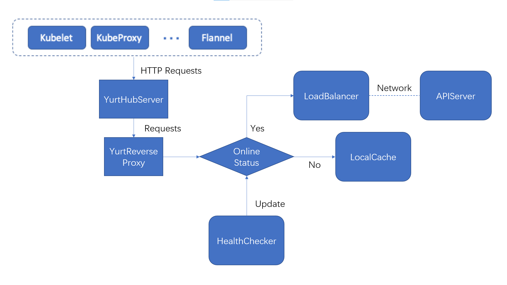

# YurtReverseProxy源码分析

## YurtReverseProxy主要功能

代理来自边缘节点（Kubelet，Kube-Proxy等）的REST请求，根据APIServer的健康状况，如果健康则将该请求通过Load Balancer转发到APIServer处理，否则在本地节点Local Proxy中进行处理。最后将reponse返回给请求方。




## YurtReverseProxy结构

YurtReverseProxy内有：

1. LoadBalacer：能判断APIServer的健康状态，并能将请求转发到APIServer处理。
2. LocalProxy：能根据本地缓存情况处理请求。
3. CacheManager：用来管理本地缓存（交由LocalProxy使用，YurtReverseProxy并不直接使用）。
4. RequestInfoResolver：用来解析request得到requestInfo。

结构体如下：

```go
type yurtReverseProxy struct {
	resolver            apirequest.RequestInfoResolver
	loadBalancer        remote.LoadBalancer
	localProxy          *local.LocalProxy
	cacheMgr            cachemanager.CacheManager
	maxRequestsInFlight int // 用来限制pending request数量的上限
	stopCh              <-chan struct{}
}
```


## YurtReverseProxy工作流程

作为YurtHubServer的一个组件，它接受YurtHubServer指定Path（除了`/v1/token`，`/v1/healthz`和一些`/debug`下的路径外）的request，并进行处理。

通过LoadBalancer判断APIServer的健康状况，如果健康则调用LoadBalancer处理请求，否则调用LocalProxy处理请求。

具体源码如下：

```go
func (p *yurtReverseProxy) ServeHTTP(rw http.ResponseWriter, req *http.Request) {
	if p.loadBalancer.IsHealthy() {
		p.loadBalancer.ServeHTTP(rw, req)
	} else {
		p.localProxy.ServeHTTP(rw, req)
	}
}
```


## What's Next

1. [LoadBalancer源码分析](./LoadBalancer源码分析.md)

2. [LocalProxy源码分析](./LocalProxy源码分析.md)