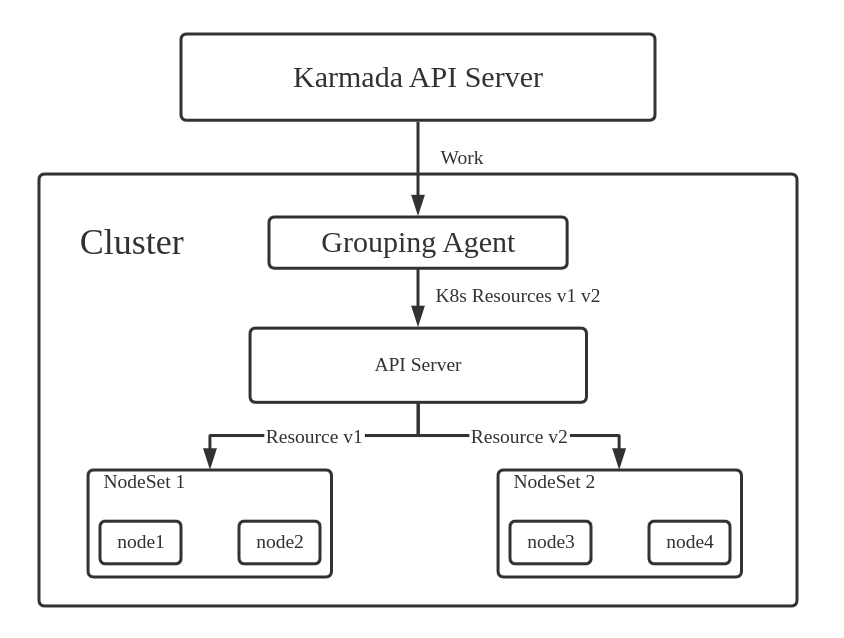
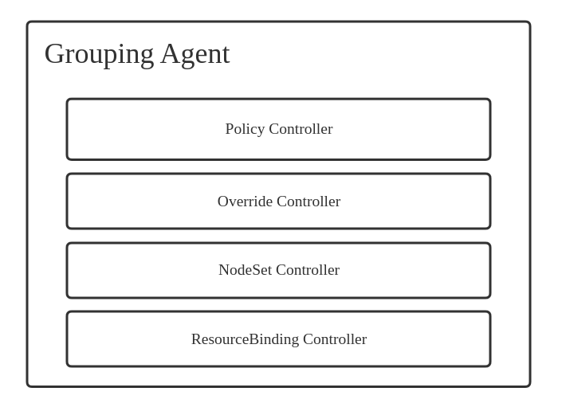
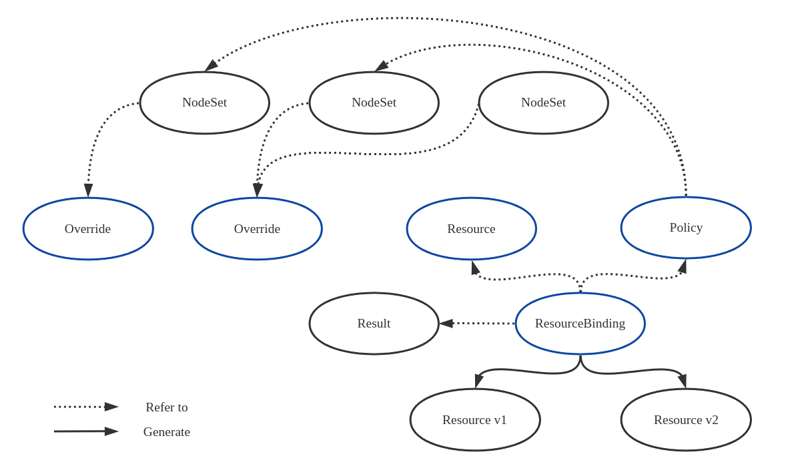

# 分组管理方案
`Version: v0.1`

## Summary
当单个集群内部节点较多时，很难通过label等原生策略对集群内部具有相同性质或作用的节点进行统一管理。因此需要扩展Karmada的管理功能，将其从集群粒度细化到单集群内部节点分组的粒度。

## Goal
1. 实现单集群内节点的分组
2. 实现在不同节点分组间的资源调度
3. 将对部署在各个分组内资源的状态聚合并上报给Karmada API Server
4. 实现的分工：运维人员负责分组和策略编写，用户通过原生方式（kubectl）或Karmada支持的方式部署资源
5. 以可选功能的形式集成在Karmada管理组件中，尽量避免对Karmada API和源码进行过多的改动。

## Architecture
  
通过在集群端增加Grouping Agent组件，实现该集群的分组管理功能。Grouping Agent会接收Karmada API Server生成的Work，将Work中的资源取出，对资源进行修改、衍生，对应各节点分组生成不同版本的资源，最后通过该集群的API Server进行资源创建、调度。

  
Grouping Agent中包含一个Controller Manager，其中有
1. Policy Controller：根据Policy选择资源可调度的节点
2. Override Controller：管理各个节点分组对应的Override
3. NodeSet Controller：管理节点分组
4. ResourceBinding Controller：将待调度的资源和调度的节点绑定，生成不同版本的资源


## CRD Design
**NodeSet**
```
NodeSet
描述：节点分组的结果
包含字段：
- 分组名
- 节点列表
- 特征标签
- Override列表
```

**Override**
```
Override
描述：对原始资源的字段进行改写
包含字段：
- 修改字段数组
- 优先级
- hard
```

**Policy**
```
描述：记录了选择节点的策略
包含字段：
- 过滤/筛选条件（Affinity，Toleration/Taint，Label，Annotation）
- 调度策略
- （各分组）数量
- 分组列表
```

**ResourceBinding**
```
ResourceBinding
描述：将待部署资源和Policy绑定
包含字段：
- 资源列表
- Policy列表
```

**Result**
```
Result
描述：记录了对应的调度结果
包含字段：
- ResourceBinding引用
- 节点列表
```



TODO: CRD具体定义

## Controller Design
TODO:


## Problem List
**优先级从高到低**
1. 如何进行状态聚合
2. 多维度分组可能会出现override冲突问题
当筛选出的节点node1，既属于NodeSet 1，又属于NodeSet 2，对应Override 1和Override 2。在生成最终资源时，Override 1和Override 2的修改字段可能相同，应该选取哪一个？
如：有AI应用专用节点组NodeSet AI，有装有GPU硬件的节点组NodeSet GPU，AI节点组要求镜像从私有仓库下载，NodeSet GPU要求镜像是GPU特化版本（指向另一仓库）。两者都会修改image，应该采取哪个Override。
目前解决方法：在Override中加入优先级字段，根据优先级选择。如果优先级相同，则反应到Status中，不进行部署。
3. 多维度部署造成某选出的节点不只从属于Policy中分组列表中的分组
假设Policy从NodeSet 1和NodeSet 2中筛选出节点Node，而Node同时从属与NodeSet 3。则在生成最终资源时，NodeSet 3的Override是否需要应用。
仍以2中为例，NodeSet 1表示AI节点组，NodeSet 2表示GPU节点组，NodeSet 3表示国内节点组。国内节点组的镜像源受网络限制，需要对镜像源进行修正。当NodeSet 3表示某（Web）应用节点组，则不需要对镜像进行修正。
目前解决方法：在Override中加入Hard字段，表示该Override所属节点组被关联到时，是否需要应用该Override，默认为false。
4. 开放Policy Controller的调度插件扩展，当k8s的原生调度（Affinity，Toleration/Taint）功能不够用时，可以自行加入调度插件（如对特定资源的Balance）
